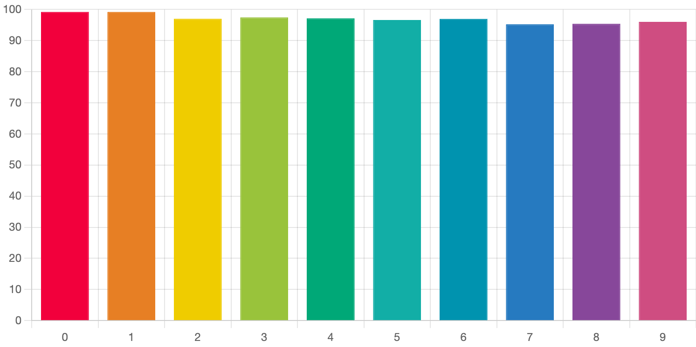
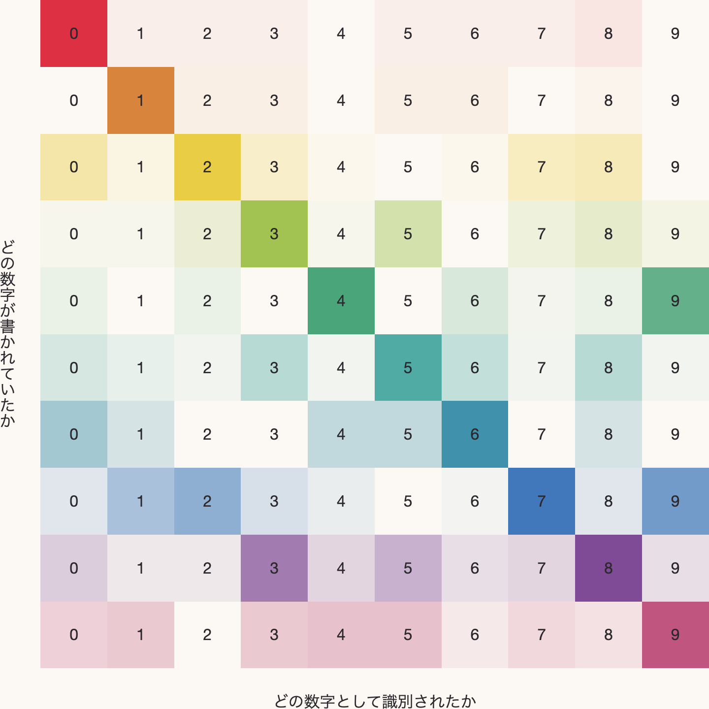

# [Handwriting Number Recognizer](https://neutron0831.github.io/brain-js/)

## Brain.jsによる手書き数字の認識

[Brain.js](https://brain.js.org/)を用いて、[MNIST](http://yann.lecun.com/exdb/mnist/)の60,000枚の手書き数字の画像をニューラルネットワークに学習させました。MNISTの手書き数字と同様に、描画範囲いっぱいにではなく中央付近に納まるように数字を書くと正しく識別されやすいようです。MNISTの10,000枚のテストデータを用いたところ、各数字の識別率に関しては“１”と“２”が最高となりましたが、どの数字も95%を上回りました。

## 各数字の識別率

下の図は、テストデータの各数字がニューラルネットワークによってどのように学習されたのかを表しています。例えば、テストデータの“０”がどの数字として識別されたのかを知りたい場合は、一番最初の行である０行目(インデックスは0から始まるものとします)を見ます。セルの色の濃度が濃ければ濃いほど、その数字として識別される確率が高いことを示しています。

## 各数字(行)がどの数字(列)として識別されたか

この図を見ていると、私たち人間でも共感できるような特徴が見て取れます。例えば、“４”と“９”は書き方によっては人間が見ても形が似るため、ニューラルネットワークでも互いに誤って識別される確率が高かったです。また、“４”と書いたつもりの数字が“９”と誤認識される確率(5行10列目)は高いですが、“９”と書いたつもりの数字が“４”と誤認識される確率(10行5列目)はそれほど高くないのも興味深いです。

## ネットワーク構成図

画像データの学習では畳み込みニューラルネットワーク(CNN: Convolutional Neural Network)が用いられることが多いですが、Brain.jsは現時点でCNNに未対応であるため、最も単純なニューラルネットワークの1つであるフィードフォワードニューラルネットワーク(FNN: Feedforward Neural Network)を用いました。今回使用したFNNは、入力層・中間層・出力層がそれぞれ1層ずつの計3層で構成されています。ノード数は、入力層はMNISTの画像サイズ(28x28)である784で、中間層は392、出力層は0～9の数字に対応する10となっており、すべてのノードは各層の間で全結合されています。学習方法には、確率的勾配降下法の一種である[モメンタム法](https://ja.wikipedia.org/wiki/%E7%A2%BA%E7%8E%87%E7%9A%84%E5%8B%BE%E9%85%8D%E9%99%8D%E4%B8%8B%E6%B3%95#%E3%83%A2%E3%83%A1%E3%83%B3%E3%82%BF%E3%83%A0%E6%B3%95)が用いられており、図に記したパラメータ設定で20,000回学習を行いました。
